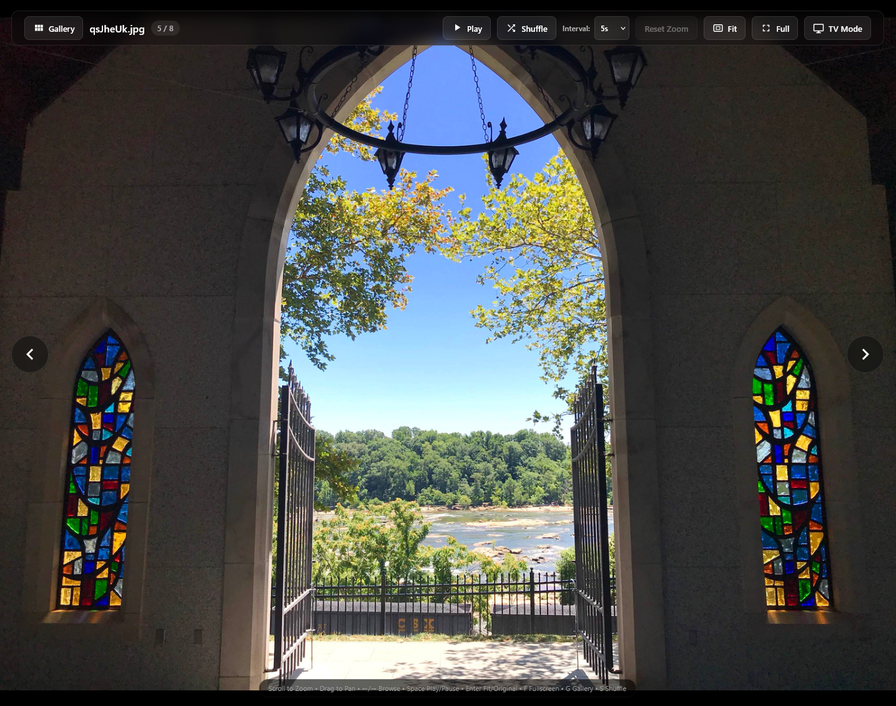

<h1>
  <picture>
    <source media="(prefers-color-scheme: dark)" srcset="docs/images/folderframe-logo.png">
    <source media="(prefers-color-scheme: light)" srcset="docs/images/folderframe-logo-light.png">
    
  </picture>
</h1>

FolderFrame works as a standalone, self-hosted photo and video gallery or as
an embedded gallery or slideshow within your websites. Use it on its own,
or add it to an existing page with a standard iframe—including an optional
controls-free slideshow mode.

[](https://paypal.me/machogrog)

See the [project roadmap](TODO.md) for planned improvements to thumbnails, performance, mobile controls, and configuration. Interested in helping? Read the [contributing guide](CONTRIBUTING.md).

## Preview

Configure media paths and separate index/embed startup defaults in
[folderframe.config.json](folderframe.config.json). See the
[configuration guide](CONFIGURATION.md) for examples, including autoplay.

### Full media viewer



### Gallery and album view


## Overview

This is a lightweight, self-hosted photo and video gallery. It reads the
contents of configured media directories dynamically from the web server’s
directory listing, so there is no database, import process, or manually
maintained media list.

- **Folder-based albums:** thumbnail grid, image cover previews with folder badges, nested albums, breadcrumbs, and recursive All Pics view.
- **Photos and videos:** JPEG, PNG, WebP, GIF, HEIC/HEIF conversion, and MP4/MOV playback (browser codec support applies).
- **Slideshow and TV mode:** selectable intervals, Shuffle, fullscreen, automatic rescans, and automatic skipping of failed media.
- **Responsive viewer:** compact mobile controls, pinch zoom, pan, and Fit/Original sizing.
- **Embeddable:** iframe example and an optional controls-free, muted-video slideshow.
- **Configurable startup:** named media sources, separate index/embed defaults, saved preferences, and URL overrides.
- **Clear feedback:** folder scan progress, thumbnail placeholders, media loading indicators, and recovery guidance.
- **Static-server hosting:** no database or build step; works with a web server that supplies HTML directory listings.

## Configuration quick reference

Edit `folderframe.config.json` beside `index.html`, then reload—no server
restart is needed. This complete example keeps the main gallery interactive
and starts the embed as a controls-free slideshow including subfolders:

```json
{
  "sources": [
    { "id": "photos", "label": "Photos", "path": "photos/" }
  ],
  "defaults": {
    "source": "photos",
    "album": "",
    "view": "folders",
    "interval": 5,
    "imageMode": "fit",
    "shuffle": false,
    "autoRefresh": true,
    "tvMode": false,
    "autoplay": false,
    "controls": true,
    "showFilenames": true,
    "rememberPreferences": true
  },
  "index": {},
  "embed": {
    "view": "all",
    "autoplay": true,
    "controls": false,
    "rememberPreferences": false
  }
}
```

This is an example, not the shipped defaults: the supplied embed starts paused
with controls visible. Each source requires a unique `id`, a display `label`,
and a served web-directory `path`. Use relative paths, server-root paths,
or HTTP(S) directories—not disk/UNC paths. Cross-origin sources require
appropriate CORS headers. This file is publicly readable: never put secrets in it.

Put settings in `defaults` for both profiles or in `index`/`embed` to override them.

| Setting | Built-in default | Allowed values / meaning |
| --- | --- | --- |
| `source` | First configured source | A source ID from `sources` |
| `album` | `""` | Path within the source, e.g. `"Friends/2026"` |
| `view` | `"folders"` | `"folders"` or `"all"` (recursive) |
| `interval` | `5` | Seconds: 3, 5, 10, 15, 30, 60 |
| `imageMode` | `"fit"` | `"fit"` or `"original"` |
| `shuffle` | `false` | Boolean |
| `autoRefresh` | `true` | Boolean: rescan every 30 seconds |
| `tvMode` | `false` | Boolean: fit/shuffle/auto-refresh/autoplay preset |
| `autoplay` | `false` | Boolean: enter viewer and start slideshow |
| `controls` | `true` | Boolean: false opens viewer without controls; videos are muted |
| `showFilenames` | `true` | Boolean: show viewer filename and grid media captions |
| `rememberPreferences` | Index: `true`; embed: `false` | Boolean: read/write browser preferences |

Precedence: built-in defaults → shared defaults → selected profile → saved
preferences (when enabled) → explicit URL options. The supplied config explicitly
disables remembered preferences for embed. TV mode provides a preset; explicit
settings in the same or higher-priority layer override that preset.

Saved preferences cover album, interval, sizing, view, Shuffle, and Auto Refresh;
not TV mode, autoplay, controls visibility, or filename visibility.
Use `rememberPreferences: false` or `?remember=0` to ignore old preferences
without deleting them.

Hide filenames with `showFilenames: false` in defaults/index/embed, or
`?showFilenames=0` (use `showFilenames=1` to show them). Album names,
accessible labels, and error details remain available.

An iframe uses the embed profile only when its URL includes `?profile=embed`.
For example, `?profile=embed&controls=0&autoplay=1&view=all`.
Autoplay uses the selected folder's files; choose `view: "all"` for subfolders.
To restore the controls, use `controls=1`. Browser video-autoplay and fullscreen
restrictions still apply. See [CONFIGURATION.md](CONFIGURATION.md) for source
examples, all URL aliases, validation rules, and full precedence details.

IMPORTANT: DO NOT OPEN index.html DIRECTLY

Browsers restrict directory scanning when a page is opened with the
file:// protocol. The gallery must be served over HTTP or HTTPS by a web
server that provides directory listings for photos/ and its subfolders.

PROJECT LAYOUT

The photos/ folder included in the GitHub repository contains test photos and
videos for checking various supported media formats. These sample files are
not required to use FolderFrame; replace them with your own media or configure
a different source folder.

Keep the files arranged like this:

    FolderFrame/
    ├── index.html
    ├── styles.css
    ├── app.js
    ├── settings.js
    ├── folderframe.config.json
    ├── heic2any.min.js
    └── photos/
        ├── photo1.jpg
        ├── photo2.heic
        ├── video1.mp4
        ├── Family/
        │   ├── birthday.jpg
        │   └── 2026/
        │       └── vacation.jpg
        └── Vacations/
            └── OBX/
                └── beach.jpg

Subfolders under photos/ automatically appear as albums.

OPTION 1 — QUICK LOCAL TEST WITH PYTHON

Python’s built-in HTTP server is the easiest way to test or use the
gallery on a local machine.

1.  Open a terminal in the FolderFrame project directory.

Example:

    cd /home/grog/projects/FolderFrame

2.  Start the server:

    python3 -m http.server 8000

3.  Open a browser on the same computer and visit:

    http://localhost:8000

4.  To access it from another device on the same LAN, use the server’s
    LAN IP:

    http://SERVER-IP:8000

For example, if the server is 192.168.1.50:

    http://192.168.1.50:8000

Python’s built-in server automatically provides the directory listings
the gallery needs, including listings for nested album folders.

Stop the Python server with Ctrl+C.

NOTE: Python’s built-in server is excellent for testing and trusted
local-network use. For a permanent installation, use any static web
server that can provide directory listings.

OPTION 2 — HOSTING ON A WEB SERVER OR UNRAID

FolderFrame is not tied to a specific web server. Apache, Nginx, Caddy,
lighttpd, and similar servers can all work. On Unraid, use any suitable
web-server container and map the FolderFrame directory into its web root.

The web root should contain:

    index.html
    styles.css
    app.js
    settings.js
    folderframe.config.json
    heic2any.min.js
    photos/

Configure the server to return a browsable directory listing for photos/
and every nested folder beneath it. The exact setting may be called
directory listing, directory browsing, autoindex, or indexes depending on
the server. FolderFrame only requires normal static-file serving plus
those directory listings; it does not require PHP, a database, or a
server-side application.

On Unraid, map the FolderFrame project directory to the container’s web
root, enable directory listings for photos/, and restart the container.
Consult the selected container or web server’s documentation for its
specific configuration syntax.

Test directory listing directly by visiting:

    http://SERVER-IP:PORT/photos/

You should see a server-generated list of the files and folders in
photos/.

Then open:

    http://SERVER-IP:PORT/

to use the gallery.

ADDING, REMOVING, AND ORGANIZING MEDIA

MEDIA

Add or remove files directly inside photos/ or any album subfolder.

The gallery recognizes:

Images: .jpg .jpeg .png .webp .gif .heic .heif

Animated and static GIF files are displayed directly by the browser and
participate in slideshows like other images.

Videos: .mp4 .mov

The browser must support the codec contained inside a video file. A .mov
or .mp4 extension alone does not guarantee browser playback.

ALBUMS

Create folders inside photos/ to create albums.

Example:

    photos/
    ├── Family/
    ├── Kids/
    └── Vacations/
        ├── OBX 2026/
        └── Disney/

Folders appear as album cards. Albums can contain additional subfolders.

Use the breadcrumb at the top of the gallery to move back through the
album hierarchy.

REFRESHING

Click “Refresh Folder” to scan immediately.

When Auto Refresh is enabled, the current folder is rescanned every 30
seconds. The gallery also rescans when you return to the browser tab.

This means newly added or removed media can appear without manually
rebuilding anything.

HEIC / HEIF SUPPORT

The gallery includes the local heic2any.min.js decoder.

For genuine HEIC/HEIF files, the browser can convert the image to JPEG
for display when native browser rendering is unavailable.

The gallery also performs content-aware handling for files whose
extension does not match their actual contents. For example, a file
named:

    IMG_3954.heic

that actually contains JPEG data can be recognized and displayed as JPEG
rather than incorrectly being sent through the HEIC decoder.

HEIC decoding is more CPU- and memory-intensive than displaying normal
JPEG, PNG, or WebP images. Large collections of genuine HEIC files may
therefore take longer to populate than JPEG-based galleries.

GALLERY CONTROLS

GRID / ALBUM VIEW

The compact header places the album/file count beside the directory breadcrumb.
Click or tap the FolderFrame logo to return to the current source's top-level
gallery. This works in both the standalone gallery and the embedded grid.

Album tiles preview the first image directly inside that folder, using the
same natural filename order as the gallery (for example, 2.jpg before 10.jpg).
A blue folder badge and the album name distinguish covers from individual
photos. Empty, video-only, nested-folder-only, or failed previews keep the
folder icon. Covers do not recursively scan descendant albums.

Previews load near the visible grid, with up to three directory lookups/HEIC
conversions at once. They use original images, not generated thumbnails.
Use Refresh Folder to reselect covers after changing files inside albums;
unchanged background refreshes keep existing tiles. There is no cover.jpg
override yet.

-   The site opens in the thumbnail grid by default; configured autoplay opens the viewer.
-   Click a photo or video to open the full viewer.
-   Click an album card to enter that folder.
-   Use the breadcrumb to navigate back through albums.
-   Click “Refresh Folder” for an immediate rescan.
-   Toggle “Auto Refresh” to enable or disable the 30-second automatic
    rescan.
-   Toggle “By Folder” / “All Pics” to switch between album browsing and
    recursively showing media from the current folder and its subfolders.

VIEWER NAVIGATION

-   Left Arrow button: previous media
-   Right Arrow button: next media
-   Keyboard Left Arrow: previous media
-   Keyboard Right Arrow: next media
-   Gallery button: return to the thumbnail/album grid
-   Press G to return to the thumbnail/album grid

SLIDESHOW

-   Click Play / Pause to start or stop the slideshow.
-   Press Space to start/pause from the full viewer.
-   Available intervals are: 3 seconds 5 seconds 10 seconds 15 seconds
    30 seconds 60 seconds

SHUFFLE

-   Click Shuffle to toggle randomized slideshow progression.
-   Press S while in the full viewer to toggle Shuffle.
-   Manual Previous/Next navigation remains available.

LOADING FEEDBACK

Folder scans show a scanning/refreshing message; recursive scans report folders
checked and files found (not a percentage). Existing tiles stay visible while
refreshing, and unchanged refreshes do not recreate them. Thumbnail placeholders
clear when previews load, or show Preview unavailable on failure.
The viewer indicates Loading image, Preparing HEIC image, or Loading/Buffering
video until ready. Empty folders and scan failures have separate messages.
Controls-free slideshows hide loading indicators. Reduced-motion preferences
are respected. These indicators do not reduce the original download/decode cost.

ZOOM AND PAN

Swipe left/right on a fitted, unzoomed photo to browse. Once zoomed or panned,
dragging pans instead; pinch gestures, short taps, and vertical swipes do not
change photos. Swiping does not control videos or controls-free embeds.
Returning to Gallery restores the scroll position of the originally opened
tile and briefly highlights it. If refreshed content moved the tile, it is
scrolled into view; if removed, the saved scroll position is used instead.

On phones and tablets, compact viewer controls align right and wrap as needed.
The sizing button shows an icon with Fit or Original; Full toggles fullscreen.
Long album breadcrumbs scroll sideways. Use the
arrow buttons to change media; drag on a zoomed photo to pan it.
The grid scrolls vertically, with a content-sized header and visible filenames.
Photo pinch gestures zoom the image; page zoom remains available outside the photo.

Photos support: - Mouse wheel zoom - Touch pinch-to-zoom - Mouse/finger
drag to pan - Reset Zoom button - Escape to reset zoom/pan when the
image is magnified or displaced

IMAGE SIZING

Use the image sizing button to switch between:

    Original Size
    Fit Screen

The selected mode is remembered by the browser. Press Enter in the full
viewer to switch between Fit Screen and Original Size.

FULLSCREEN / THEATER MODE

Use the Full button (beside TV Mode), or press F
in the full viewer, to enter or leave browser fullscreen.

While viewing media, controls and the mouse cursor fade after
approximately 3 seconds of inactivity. Mouse, touch, or keyboard
activity brings them back.

TV / PHOTO-FRAME MODE

TV Mode is intended for a television, wall display, tablet, or other
dedicated photo-frame screen.

Enabling TV Mode: - switches images to Fit Screen - enables Shuffle -
enables Auto Refresh - starts the slideshow - attempts to enter browser
fullscreen

Press T in the full viewer to toggle TV Mode.

Exiting fullscreen turns TV Mode off and pauses its slideshow. TV Mode is
not saved in browser preferences; explicit tvMode config or tv=1 URL defaults
still apply on reload. Use tv=0 to override those defaults.

Browsers generally require a user gesture before true fullscreen is
allowed, so automatic URL startup can configure TV behavior but may not
be able to force fullscreen by itself.

SAVED SETTINGS

The gallery stores preferences in the browser’s localStorage.

Settings such as the following can persist between visits: - current
album - slideshow interval - image sizing mode - folder/all-pics view -
Shuffle - Auto Refresh

These preferences are local to that browser/device.

Preferences are now separated by app location, source, and index/embed profile.
The supplied embed profile ignores saved preferences. Use rememberPreferences
in folderframe.config.json or the remember URL option to control persistence.
See [CONFIGURATION.md](CONFIGURATION.md) for settings and precedence.

URL OPTIONS

The gallery supports URL query parameters, which are useful for
bookmarks and dedicated displays.

Supported options:

    profile=index or profile=embed
        Select the configuration profile (index by default).

    source=ID
        Select a source defined in folderframe.config.json.

    remember=0 or remember=1
        Ignore or use saved browser preferences.

    imageMode=fit or imageMode=original
        Override the initial image sizing mode.

    album=FOLDER
        Open a specific album path.

    interval=SECONDS
        Set slideshow interval.
        Valid values: 3, 5, 10, 15, 30, 60

    shuffle=1 or shuffle=0
        Enable or disable Shuffle.

    autorefresh=0 or autorefresh=1
        Disable or enable Auto Refresh.

    view=all
        Show media in the selected folder and all its subfolders.

    view=folders
        Show the normal folder/album view.

    autoplay=1 or autoplay=0
        Enter the viewer and start slideshow playback, or start paused in the grid.

    tv=1 or tv=0
        Enable TV/photo-frame behavior:
        Fit Screen + Shuffle + Auto Refresh + slideshow playback.
        Use tv=0 to disable TV mode; explicit URL options override the preset.

Examples:

Open the Family album:

    http://SERVER-IP:PORT/?album=Family

Open a nested album:

    http://SERVER-IP:PORT/?album=Vacations/OBX%202026

Start a shuffled 10-second slideshow:

    http://SERVER-IP:PORT/?autoplay=1&shuffle=1&interval=10

Start TV/photo-frame mode:

    http://SERVER-IP:PORT/?tv=1&interval=10

Open an album directly in TV mode:

    http://SERVER-IP:PORT/?album=Family&tv=1&interval=10

Replace SERVER-IP:PORT with the actual address of the machine hosting
the gallery.

EMBEDDING FOLDERFRAME

FolderFrame can be embedded in another site with a standard iframe. This
keeps its controls, styles, slideshow, and media handling isolated from the
host page. The included embed.html file is a complete responsive example.

Basic embed:

For a controls-free slideshow, set these fields in the config file's `embed`
section (keep your other sections):

```json
"embed": {
  "controls": false,
  "autoplay": true,
  "view": "all",
  "interval": 10,
  "rememberPreferences": false
}
```

`controls` defaults to `true` and also works under `defaults` or `index`.
False hides all viewer controls, the grid, progress, and media-error cards;
keyboard shortcuts and photo gestures are disabled. Videos are muted.
The viewer opens directly; `autoplay: true` starts the slideshow, and
`view: "all"` includes subfolders. Failed files skip after 3 seconds during play.
Empty-library messages and config warnings remain visible. Browser autoplay
restrictions still apply. Use `?profile=embed&controls=0&autoplay=1` to override
via URL, or `controls=1` to restore controls. See [CONFIGURATION.md](CONFIGURATION.md).

Basic iframe:

    <div class="folderframe-embed">
      <iframe
        src="https://YOUR-FOLDERFRAME-SERVER/?profile=embed"
        title="Photo and video gallery"
        loading="lazy"
        allowfullscreen>
      </iframe>
    </div>

    <style>
    .folderframe-embed {
      width: 100%;
      aspect-ratio: 16 / 9;
      min-height: 420px;
    }
    .folderframe-embed iframe {
      width: 100%;
      height: 100%;
      border: 0;
      border-radius: 12px;
    }
    </style>

The iframe URL accepts the same source, album, view, interval, shuffle, autoplay,
autorefresh, tv, imageMode, and remember options documented above. Use
profile=embed to apply embed defaults from folderframe.config.json; otherwise
the index defaults apply, even inside an iframe. Keyboard shortcuts work after
the visitor clicks or focuses the embedded gallery.

The web server hosting FolderFrame must permit framing. Remove or adjust an
X-Frame-Options header that blocks the host page, and ensure any Content-
Security-Policy frame-ancestors directive allows the site doing the embedding.
Fullscreen and autoplay remain subject to browser policies.

TROUBLESHOOTING

NO MEDIA FILES DETECTED

1.  Verify photos/ exists beside index.html.
2.  Open /photos/ directly in the browser.
3.  Confirm that a directory listing appears.
4.  Confirm the files use supported extensions.
5.  Verify directory listing or directory browsing is enabled for
    /photos/ and its subfolders.
6.  If using Python, make sure python3 -m http.server 8000 was started
    from the FolderFrame project directory, not from inside photos/.

CHANGES DO NOT APPEAR

-   Click Refresh Folder.
-   Verify Auto Refresh is enabled.
-   Hard-refresh the browser if JavaScript/HTML/CSS files themselves
    were changed.
-   Confirm you edited the copy of the site that the active web server
    is serving.

HEIC IMAGE FAILS

The viewer shows recovery guidance for image and video failures. Retry reloads
the file, Next file moves on, Gallery returns to the grid, and Open original
opens the source in a separate tab. A running slideshow skips failed media after
3 seconds (or retries if there is only one file); Pause stops automatic skipping.
Manual browsing does not advance automatically. Browser-blocked autoplay is reported separately
from network and decoding errors. Originals are never modified.

-   Open browser Developer Tools and check the Console.

-   Check the Network tab and verify the image request returns HTTP 200.

-   On Linux, inspect the real file type with:

    file photos/filename.heic

-   A .heic filename is not proof that the file actually contains HEIC
    data.

VIDEO FAILS

A recognized filename can still contain a codec the browser cannot
decode. Check the browser console for playback errors. Converting the
video to a browser-friendly H.264/AAC MP4 is generally the most
compatible option.

PYTHON SERVER IS RUNNING BUT ANOTHER DEVICE CANNOT CONNECT

-   Use the server’s LAN IP instead of localhost.
-   Confirm TCP port 8000 is allowed by the host firewall.
-   Confirm both devices can reach each other on the network.

SECURITY NOTES

The gallery does not provide authentication by itself.

If the server is exposed outside your trusted LAN: - add authentication
at the web-server/reverse-proxy layer - use HTTPS - do not expose a raw
directory listing of private photos to the public Internet

For a local-only family gallery, keeping the service accessible only
from the trusted LAN is the simplest arrangement.

SUPPORT FOLDERFRAME

If FolderFrame is useful to you, you can support its continued development:

    https://paypal.me/machogrog

LICENSE

FolderFrame is available under the MIT License. See LICENSE for details.
